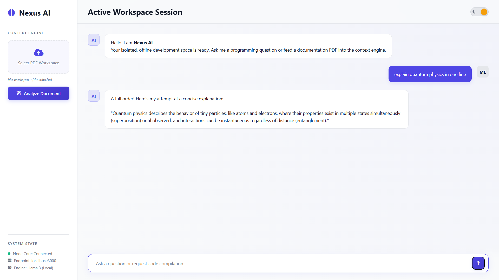

# 🚀 Nexus AI Chatbot

A premium, fully offline AI workspace powered by **Node.js**, **Express**, and a locally hosted **Llama 3** model through **Ollama**.
Nexus AI delivers a highly tactile user experience, real-time document analysis, and a privacy-first architecture — all without subscriptions, cloud APIs, or usage limits.

---

# 📸 Interface Preview



> Modern glassmorphism workspace featuring tactile controls, dynamic system monitoring, smooth animations, and a premium adaptive theme engine.

---

# ✨ Features

## 🔒 100% Offline & Private

Run powerful large language models entirely on your own hardware.

* No API keys
* No subscription fees
* No internet dependency
* Complete local data privacy

---

## 🎨 Premium Tactile Workspace UI

A modern desktop-inspired interface designed for fluid interaction.

### Includes

* Glassmorphism layout system
* Neon gradient action controls
* Smooth micro-interaction scaling
* Adaptive light/dark mode toggle
* Real-time response streaming
* Minimal latency chat rendering

---

## 📄 Intelligent PDF Context Extraction

Upload software documentation, notes, or technical PDFs directly into the workspace.

The isolated extraction pipeline:

* Parses text dynamically
* Builds contextual memory
* Enhances local model responses
* Prevents inference contamination

---

## ⚡ Zero-Crash Hardware Safety Layer

Nexus AI automatically configures a stable inference environment for maximum compatibility.

### Automatic Runtime Constraints

```env
CUDA_VISIBLE_DEVICES=-1
OLLAMA_NUM_PARALLEL=1
```

### Benefits

* Prevents GPU conflicts
* Avoids VRAM crashes
* Ensures stable CPU fallback execution
* Eliminates manual environment tweaking

---

# 🧠 System Architecture

The backend communicates directly with the locally running Ollama daemon through:

```txt
http://localhost:11434
```

### Architecture Flow

```txt
Frontend UI
   ↓
Express API Gateway
   ↓
PDF Context Pipeline
   ↓
Ollama Local Runtime
   ↓
Llama 3 Inference Engine
```

---

# 🛠️ Tech Stack

## Frontend

* HTML5
* CSS3
* Vanilla JavaScript
* Font Awesome

### UI Features

* Glassmorphism styling
* Dynamic theme switching
* Native fetch streaming
* Responsive workspace layout

---

## Backend

* Node.js
* Express.js
* CORS Middleware

---

## Data Processing

* Multer
* pdf-parse-fixed

---

## AI Runtime

* Ollama
* Llama 3

---

# 📦 Installation

## 1. Clone Repository

```bash
git clone https://github.com/nagamanikanta5455/nexus-ai-chatbot.git
cd nexus-ai-chatbot
```

---

## 2. Install Dependencies

```bash
npm install
```

---

## 3. Install Ollama

Download and install Ollama:

👉 https://ollama.com

---

## 4. Pull Llama 3 Model

```bash
ollama pull llama3
```

---

# 🚀 Running the Project

## Start Backend Server

```bash
node index.js
```

---

## Launch Frontend

Open the client interface directly in your browser:

```txt
chat.html
```

### Recommended Browser

* Google Chrome

---

# 📁 Project Structure

```txt
GEN-AI/
│
├── ChatApp-genai-frontend-main/
│   └── README.md (old/backup if kept)
├── node_modules/
├── .gitignore
├── chat.html
├── index.js
├── package-lock.json
├── package.json
├── preview.png
└── README.md
```

---

# 🧪 Example Use Cases

* Local AI coding assistant
* Offline research workspace
* PDF technical documentation analysis
* Privacy-focused chatbot environment
* Lightweight AI desktop console
* Educational AI sandbox

---

# 🔥 Why Nexus AI?

Unlike cloud-based AI platforms, Nexus AI gives you:

✅ Full ownership of your data
✅ Unlimited local inference
✅ Zero monthly costs
✅ Complete offline functionality
✅ Direct hardware-level control

---

# 📌 Future Roadmap

* Multi-model switching
* Voice interaction pipeline
* Persistent conversation memory
* Markdown rendering engine
* Workspace plugin system
* Electron desktop packaging

---

# 📜 License

MIT License

---

# 🤝 Contributing

Pull requests, feature ideas, and optimizations are welcome.

If you build something cool with Nexus AI, feel free to fork and expand the ecosystem.

---

# ⭐ Support

If you found this project useful, consider starring the repository to support development.
